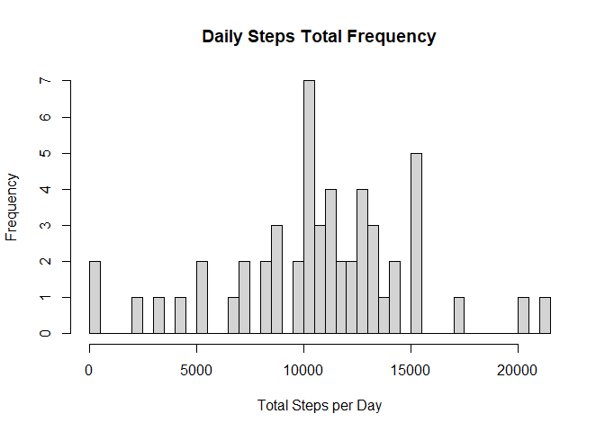
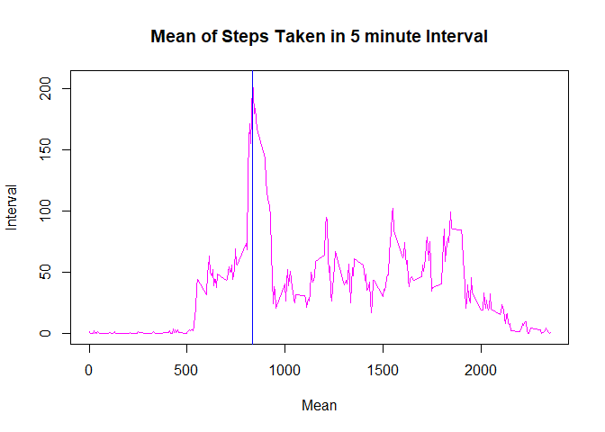
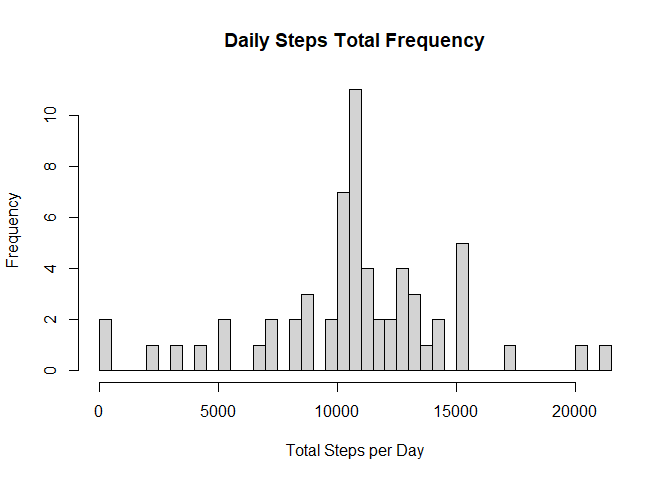
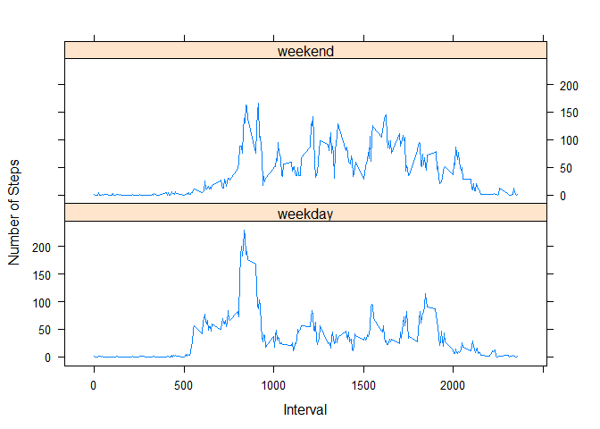

For this project we will be using the following libraries. 
If you do not have them installed, please do so before running the code chunks.

- dplyr
- lattice


## Loading and preprocessing the data

The activity data can be loaded using the `read.csv()` function. 
To simplify the analysis process we will use the dplyr package. 
We will also convert the date column to Date.


```r
# The dplyr library is already loaded earlier.
data <- as_tibble(read.csv("activity.csv"))
data$date <- as.Date(data$date, format = "%Y-%m-%d")
```


## What is mean total number of steps taken per day?

Task: We are required to determine the following:

1. Calculate the total number of steps taken per day
2. Calculate and report the mean and median of the total number of 
steps taken per day

This can be achieved with a single call to summarize grouped by date. 
We will remove the NA values to calculate the totals, mean and median.


```r
daily_summary <- data %>% group_by(date) %>% 
  summarise(daily_total = sum(steps), .groups = "keep")
```

Task: Make a histogram of the total number of steps taken each day


```r
# set breaks to equal to the number of observations
hist(daily_summary$daily_total, main = "Daily Steps Total Frequency", 
     xlab = "Total Steps per Day", breaks = nrow(daily_summary))
```

<!-- -->

Mean of the Total Steps daily

```r
ori_mean <- mean(daily_summary$daily_total, na.rm = TRUE)
ori_mean
```

```
## [1] 10766.19
```

Median of the Total Steps daily

```r
ori_median <- median(daily_summary$daily_total, na.rm = TRUE)
ori_median
```

```
## [1] 10765
```


## What is the average daily activity pattern?

To complete the tasks for this section, we need to summarize the data by the intervals. 


```r
activity_summary <- data %>% group_by(interval) %>% 
  summarise(mean = mean(steps, na.rm = TRUE), .groups = "keep")
```

Task: Make a time series plot of the 5-minute interval (x-axis) and the 
average number of steps taken, averaged across all days (y-axis)


```r
with(activity_summary, {
     plot(mean~interval, 
          data = activity_summary, 
          type = "l", 
          xlab = "Mean", 
          ylab = "Interval", 
          main = "Mean of Steps Taken in 5 minute Interval", 
          col = "magenta")
  
     abline(v = activity_summary[[which.max(activity_summary$mean), 1]], 
            col = "blue")
})
```

<!-- -->


Task: Which 5-minute interval, on average across all the days in the dataset, 
contains the maximum number of steps?

The interval with the highest mean value is: 


```r
activity_summary[[which.max(activity_summary$mean), 1]]
```

```
## [1] 835
```


## Imputing missing values

Task: Calculate and report the total number of missing values in the data set


```r
sum(is.na(data))
```

```
## [1] 2304
```

Task: Devise a strategy for filling in all of the missing values in the data set. 

We can use the mean of the 5 minute interval to impute the missing values. 

Task: Create a new dataset that is equal to the original dataset but with the missing data filled in.


```r
# generate the new fill value to use from the mean
activity_summary$fill_val <- as.integer(activity_summary$mean)

# fill the value to the missing intervals into new data set
data2 <- data
apply(data2[is.na(data2$steps), ], c(1), function (x) { 
  date <- x[2]
  interval <- as.integer(x[[3]])
  fill <- as.integer(activity_summary[activity_summary$interval == interval, 3])

  data2[data2$date == date & data2$interval == interval, 1] <<- fill
})
```

Task: Make a histogram of the total number of steps taken each day 

```r
# create new summary using new data
daily_summary2 <- data2 %>% 
  group_by(date) %>% 
  summarise(daily_total = sum(steps), .groups = "keep")

# set breaks to equal to the number of observations
hist(daily_summary2$daily_total, main = "Daily Steps Total Frequency", 
     xlab = "Total Steps per Day", breaks = nrow(daily_summary2))
```

<!-- -->
Task: Calculate and report the mean and median total number of steps taken 
per day


```r
new_mean <- mean(daily_summary2$daily_total)
new_median <- median(daily_summary2$daily_total)
```

|      |Original Value | New Value |
|------|---------------|-----------|
|Mean| 10766.19 | 10749.77|
|Median| 10765 | 10641|

## Are there differences in activity patterns between weekdays and weekends?

Task: Create a new factor variable in the dataset with two levels – “weekday” and “weekend” indicating whether a given date is a weekday or weekend day.


```r
data2[grepl("Saturday|Sunday", weekdays(data2$date)), 'is_weekend'] <- "weekend"
data2[!grepl("Saturday|Sunday", weekdays(data2$date)), 'is_weekend'] <- "weekday"
data2$is_weekend <- as.factor(data2$is_weekend)
```

Task: Make a panel plot containing a time series plot of the 5-minute interval (x-axis) and the average number of steps taken, averaged across all weekday days or weekend days (y-axis).


```r
summary2 <- data2 %>% 
  group_by(interval, is_weekend) %>%
  summarise(avg = mean(steps), .groups = "keep")

xyplot(avg~interval|is_weekend, 
       data = summary2, 
       type = "l" , 
       ylab = "Number of Steps", 
       xlab = "Interval",
       layout = c(1,2))
```

<!-- -->

